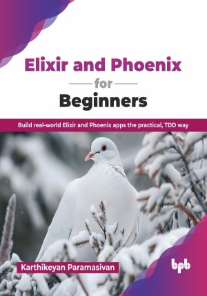

# Elixir and Phoenix for Beginners

Build real-world Elixir and Phoenix apps the practical, TDD way.

This is the repository for [Elixir and Phoenix for Beginners
](https://bpbonline.com/products/elixir-and-phoenix-for-beginners?variant=44833787085000),published by BPB Publications.

## About the Book
Elixir is the modern, powerful programming language designed for massive scale and reliability, perfectly suited for today’s concurrent web applications. Built on the proven Erlang virtual machine (BEAM), Elixir empowers developers to build fast, fault-tolerant systems that simply do not crash. This book provides a clear, sequential path for beginners to master the functional programming mindset, preparing you to leverage these cutting-edge tools in a professional environment.

This book is a hands-on guide to building reliable, scalable software with Elixir and Phoenix. You will develop a solid functional mindset before moving to the BEAM’s powerful concurrency model with lightweight processes and OTP. You will learn to design resilient services with GenServers and supervision trees, test confidently with ExUnit, and automate everyday tasks with Mix. You will also build and deploy web services using the Phoenix Framework and Ecto database interaction. Also, by using practical examples and hands-on exercises, readers will learn Elixir's syntax and basic data types.

By the end of this book, you will be fully equipped to handle Elixir projects. You will gain the practical skills and confidence needed to successfully develop, deploy, and maintain your own robust, scalable, and fault-tolerant Elixir applications in a real-world environment.

## What You Will Learn
• Understand FP and BEAM processes.

• Write resilient OTP services.

• Build Phoenix apps with Ecto and components.

• Test with ExUnit and ship Mix releases.

• Apply everything via a TDD capstone project.

• Create dynamic UIs with Phoenix Components.

• Comprehend Elixir syntax and basic data structures.

• Interact with databases using the Ecto library.
